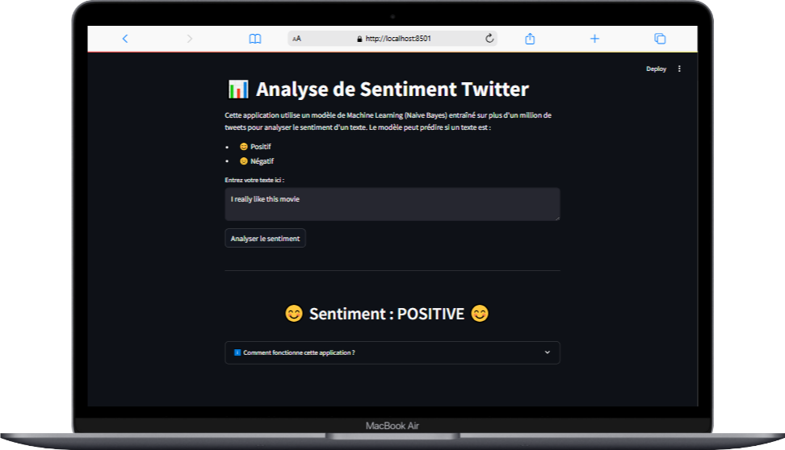
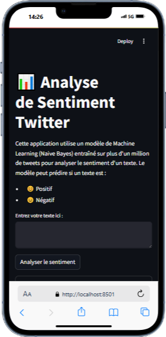

# Analyse de Sentiment sur des Commentaires Textuels

Ce projet vise à prédire automatiquement le **sentiment** (positif, neutre, négatif) de commentaires issus des réseaux sociaux. Il a été développé dans le cadre de mon apprentissage personnel pour mais surtout pour montrer à ma communauter comment on entraine un modèle et comment on peut l'utiliser dans une application web. Lien de la démo : ``` https://sentimentsanalysiswebapplication-zqrzahzutpxnfuqyv7q9iy.streamlit.app/ ```

> **💡 Important :**
> - Une première version du modèle, basée sur un petit dataset, a montré ses limites en production.
> - Une seconde version, plus robuste, a été développée et intégrée à l’application web Streamlit.
> - Ce README explique la démarche, les choix, et guide l’utilisateur pour utiliser l’application.

---

## 📋 Contexte & Objectifs

L’analyse des opinions (sentiment analysis) est essentielle pour la veille, le marketing, la réputation, etc.  
Ce projet propose :

- Un pipeline complet : exploration, nettoyage, vectorisation, modélisation, évaluation et sauvegarde.
- Une application web interactive pour tester le modèle sur vos propres textes.
- Une justification transparente des choix de modèles et de données.

---

## 🚦 Deux Générations de Modèles

### 1. Modèle Initial (Dataset Restreint)

- Entraîné sur un petit dataset de commentaires sociaux.
- Pipeline reproductible (prétraitement, vectorisation TF-IDF, modèles classiques).
- Résultats honnêtes mais limités par le manque de données : le modèle connaissait peu de vocabulaire et généralisait mal sur de nouveaux textes.
- **Problème identifié** : lors de l’intégration dans l’application web (voir `app.py`), trop d’erreurs et de prédictions incohérentes.

### 2. Nouveau Modèle (twitter_sentiment_model_v2)

Pour pallier cela, j'ai entrainé un **nouveau modèle** :

- **Dossier associé** : [`twitter_sentiment_model_v2/`](./twitter_sentiment_model_v2)
- **Dataset** : [Sentiment140 (Kaggle)](https://www.kaggle.com/datasets/kazanova/sentiment140)
  - 1,6 million de tweets labellisés (positif/négatif)
- **Scripts** :
  - `prepare_twitter_data.py` : prétraitement avancé
  - `train_twitter_model.py` : entraînement du modèle Naive Bayes binaire
- **Modèles fournis** :
  - `twitter_model.pkl` et `twitter_vectorizer.pkl`
- **Performances** :
  - Précision globale : **76,8 %**
  - Support équilibré entre sentiments positifs et négatifs
  - Scores F1 équivalents pour chaque classe (0,77)

#### ⚠️ Limitation actuelle

Le nouveau modèle est **binaire** : il distingue uniquement les sentiments positifs et négatifs (aucune classe « neutre » dans le dataset Sentiment140).  
Les textes neutres seront donc classés dans l’une des deux catégories : à prendre en compte dans l’interprétation des résultats.

> **Pour plus de détails sur le pipeline d’entraînement et le dataset, voir le README dans `twitter_sentiment_model_v2/`.**

---

## 🗂️ Structure du projet

- `app.py` : Application web Streamlit (racine du projet)
- `notebooks/` : Analyse exploratoire, prétraitement et modélisation du premier pipeline
- `data/` : Jeux de données (à placer manuellement, voir instructions)
- `models/` : Modèles et vectoriseurs du premier pipeline
- `twitter_sentiment_model_v2/` : Scripts, modèles et README du second pipeline
- `README.md` : Ce document

---

## ⚙️ Prérequis & Installation

### 1. Clone le repo

```bash
git clone https://github.com/ThePerformer0/Sentiments_analysis_web_application.git
cd Sentiments_analysis_web_application
```

### 2. Installe l’environnement Python

```bash
pip install -r requirements.txt
# ou, si requirements.txt absent :
pip install streamlit pandas numpy matplotlib seaborn scikit-learn nltk wordcloud
```

**Pour NLTK** (si tu utilises les notebooks ou veux réentraîner) :

```python
import nltk
nltk.download('stopwords')
nltk.download('wordnet')
nltk.download('omw-1.4')
```

### 3. Place les fichiers modèles

- Pour l’application web : place `twitter_model.pkl` et `twitter_vectorizer.pkl` (présents dans `twitter_sentiment_model_v2/`) à la racine du projet ou adapte les chemins dans `app.py` si besoin.

---

## 🚀 Lancer l’Application Web

### Sur ton PC (local)

```bash
streamlit run app.py
```

- L’application s’ouvre dans le navigateur à l’adresse indiquée (par défaut [http://localhost:8501](http://localhost:8501)).  
- Tu peux y soumettre du texte pour prédire le sentiment.

### Depuis un téléphone (via le réseau local)

1. Lance Streamlit avec l’option `--server.address 0.0.0.0` :

   ```bash
   streamlit run app.py --server.address 0.0.0.0
   ```

2. Note l’adresse IP de ton ordinateur (ex : `192.168.1.42`).
3. Depuis le navigateur de ton téléphone, ouvre :  
   `http://192.168.1.42:8501`  
   (Assure-toi que ton téléphone et ton PC sont sur le même réseau Wifi.)

#### Alternative : Exposer sur Internet

- Utilise un service comme [ngrok](https://ngrok.com/) pour obtenir une URL publique temporaire :

  ```bash
  ngrok http 8501
  ```

- Suis les instructions pour accéder à l’application depuis n’importe où.

---

## 📊 Résultats attendus

- **Modèle actuel** : Classification binaire (positif/négatif)
- **Précision** : ~77 %
- **Limite** : Les textes neutres sont classés positifs ou négatifs.
- **Visualisations** : Si tu utilises les notebooks, tu auras accès à l’analyse exploratoire, la distribution des sentiments, etc.

---

## ❓ Pourquoi avoir changé de modèle ?

- Le premier modèle, entraîné sur un petit dataset, n’a pas généralisé correctement sur de nouveaux textes : il faisait trop d’erreurs dans l’application web.
- Le second modèle, basé sur 1,6 million de tweets, connaît un vocabulaire beaucoup plus large et généralise mieux, même si la classification est binaire.
- Ce choix est un compromis : plus de robustesse et de stabilité, au prix de la perte de la classe « neutre ».
- L’application web utilise donc **exclusivement le modèle v2** pour fournir des résultats fiables.

---

## 📁 Pour aller plus loin

- Pour comprendre le pipeline initial, explore les notebooks du dossier `notebooks/`.
- Pour réentraîner le nouveau modèle ou l’améliorer, consulte le dossier `twitter_sentiment_model_v2/` et son README.
- Idées d’amélioration :  
  - Intégration d’une classe « neutre » (avec un dataset adapté)
  - Test d’algos avancés (SVM, BERT, etc.)
  - Meilleure gestion des emojis et du langage informel

---

## ✍️ Auteur

- [ThePerformer0](https://github.com/ThePerformer0)
- Email : [fjimmywilson@gmail.com](fjimmywilson@gmail.com)
- WhatsApp : +237656597799

Ne vous inquitez pas j'ai kiffé faire ce projet, vous n'avez plus qu'à regarder les notebooks et vous amuser à réentrainer les modèles.

---

## 🖼️ Aperçu de l’interface de l’application

Voici l’interface de l’application d’analyse de sentiment développée :

### Version ordinateur



### Version mobile



---

## 🙏 Suggestions & Contributions

- Clone ce repo, expérimente avec d’autres jeux de données, propose des améliorations ou ouvre une pull request !
- Toute contribution ou suggestion est bienvenue.

---

**Bon apprentissage et bonne exploration du sentiment !**
